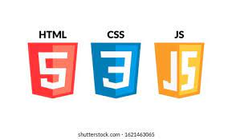

<!DOCTYPE html>
<html lang="en">
<head>
    <meta charset="UTF-8">
    <meta http-equiv="X-UA-Compatible" content="IE=edge">
    <meta name="viewport" content="width=device-width, initial-scale=1.0">
    <link rel="stylesheet" href="main.css">
    <title>Document</title>
</head>
<body class="Background">

    <!--Nav-->
    

        <a class="active" href="#home">Home</a>
        <!--Added new slideshow section-->
        <a href="#slideshow">Slideshow</a>
        <a href="#About">About</a>
        <a href="#Github">Github</a>
        <!--Onclick and ondblclick function added to open and close the contact form-->
        
    

    
    <!--Background video-->
    

        <video autoplay muted loop id="Typing_Video">
            <source src="../barnettbrittanym.github.io/background.mp4">
            <!--Display message if video fails to run-->
            Your browser does not support HTML 5 video.
        </video>
    

    <!--Video Text-->
    

        <h1 class="white-text">Brittany Barnett's Portfolio</h1>
        <strong>
            

                <q>The computer programmer is a creator of universes for which he alone is the lawgiver.
                     No playwright, no stage director, no emporer, however powerful, has ever exercised such absolute authority to arrange a stage or
                     field of battle and to command such unswervingly dutiful actors or troops.
                </q>
                  -Joseph Weizenbaum 
                 
                My name is Brittany Barnett. Welcome to my portfolio website. On it, I will tell you about my background and experience.
                 
                 Thank you for stopping by and enjoy!
            

        </strong>
    

    <!--Slideshow section added-->
    

        

            

                
                <!--Slide 1 of 6-->
                

                    
                    
I am available to assist you on your project!

                

                <!--Slide 2 of 6-->
                

                    
                    
I am a full-stack developer,  trained in:  HTML, CSS, JavaScript,

                

                <!--Slide 3 of 6-->
                

                    
                    
the popular programming language Python,

                

                <!--Slide 4 of 6-->
                

                    
                    
.NET Framework, ASP .NET, MVC,

                

                <!--Slide 5 of 6-->
                

                    
                    
back end development, databases, and SQL.

                

                <!--Slide 6 of 6-->
                

                    
                    
<a class="white-text" onclick="openForm()" href="#Contact">Contact me now!</a>

                

                <!--Previous and next buttons-->
                <a class="Previous" onclick="plusSlides(-1)">&#10094;</a>
                <a class="Next" onclick="plusSlides(1)">&#10095;</a>
            

             <!--Adds a space between the slideshow images and the dots-->

            <!--Slideshow dots-->
            

                
                
                
                
                
                
            

        

    

    <!--About section-->
    

        <!--Left Column-->
        

            
        

        <!--Right column-->
        

            <h1>About</h1>
            

                I am a software developer who loves to code! As a mother of two, I enjoy spending time with my family and working on home projects.
                 
                 I am a graduate of <a href="https://www.learncodinganywhere.com" target="_blank">The Tech Academy</a>'s Software Developer Boot Camp, and trained and experienced in the following web and programming languages: HTML, CSS, JavaScript, SQL, Python, C#, and more.'
                 
                 I am a full-stack developer and would love to work with you on your project. <a onclick="openForm()">Contact</a> me below!
            

        

    

    <!--GitHub section-->
    

        <!--Left column-->
        

            <h1>GitHub</h1>
            
You can view my coding projects on my GitHub profile here:
                 
                
<a href="https://github.com/barnettbrittanym" target="_blank">Brittany's GitHub</a>

            

        

        <!--Right column-->
        

            
        

    

    <!--Contact form-->
    

        <button onclick="openForm()" class="Pop_Up_Button">CONTACT</button>
        

            <form action="" class="form-container">
                <h1>Contact</h1>
                <label for="name"><b>Name</b></label>
                    <input type="text" placeholder="Type your name here" name="name" required>
                <label for="phone"><b>Phone</b></label>
                    <input type="text" placeholder="Type your phone number here" name="phone">
                <label for="email"><b>Email</b></label>
                    <input type="text" placeholder="Type your email address here" name="email" required>
                <label for="message"><b>Message</b></label>
                    <input type="text" placeholder="Type your message here" name="message">

                    <button type="submit" class="btn">SUBMIT</button>
                    <button type="button" class="btn cancel" onclick="closeForm()">CLOSE</button>
            </form>
        

    

    <!--Footer section-->
    <footer>
        
&#169; 2021

    </footer>
    
</body>
</html>